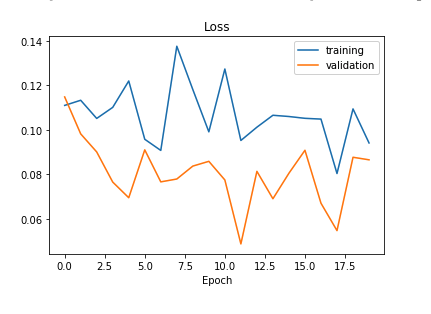

#  Behavioural Cloning for Self driving car simulation

### Final Testing Result

###### _Track 1 - completed 5 lap endurance LeMans Style test at an average of 28-29 miles per hour._
    * _This is difficult even to attempt by hand on a key board. Hence Nvidia model Udacity BC techniques proved itself_

Watch YouTube Video at https://www.youtube.com/watch?v=kLvC_4G6uJQ

#### Brief
* _Built for : Udacity SCND Term 1_

* _Built on :12 Feb 2019_

* _Git hub location : Y_

* _Ref YouTube location: Y_

* _Design Doc: Y_

* _Tech Doc: Y_

* _Test Doc: Y_

* _Rubrics_ : Checked

* _Release Notes_ : Y

### Index
* Introduction
  * How to Execute and verify
* Rubrics Check
* Background brief
* Fundamentals brief
* Iterative Process
* Data collection
* Preprocessing
* Augmentation
* Model Architecture selection
* Model building
* Model training
* Graphical verification
* Simulation testing
* Model Selection
* Model tuning
* Finalisation and metrics
* RTP prep
* Thanks and Acknowledgments
* Reference papers

### Introduction

 This project is built for Udacity 2019 Self driving car Nano degree Behavioural cloning task.
 Simulator was built on Unity and it is provided by Udacity.
This is NVIDIA model. Please refer to End to End driving paper. The loop system we are attemting to acheive finally is represented in this image.

 To execute this project, we have built it in two files. One is the python notebook which you will find along with this file in the directory. It lists conda environment module lists. You have to use conda to install the prerequisites. Second part is the simulator connector bridge which uses Flask web server to establish connection to udacity unity based simulator. This second part requires a second environment. Care must be taken as i started with a windows 10 pro on pip and tensorflow gpu, attempting to install flask+eventlet+ socket io with Pip (released pip ver 12 and above) consistently destroyed and  broke python and pip environments along with tensorflow gpu. I had to switch back to mac cpu with a conda environment.
 On the base, for simulation Unity must be installed and registered on Unity site.

### Rubrics Check

* 1 Required Files
          - model.py file -Yes 
          - drive.py -Yes 
          - model.h5 -Yes 
          - writeup report -Yes (ReadMe.md)
          - video.mp4 -Yes Corrected after review 1 for review 2
         
  Final result - https://youtu.be/ukB8AsF6UvY

* 2 Quality of Code

   The model provided can be used to successfully operate the simulation. - Yes

   The code in model.py uses a Python generator, if needed, to generate data for training rather than storing the training data in memory. The model.py code is clearly organized and comments are included where needed. - Yes

    Note : There are two ipython jupyter notebooks. First one is for initial experiments, work in progress file. Second one is the final ipython notebook for submission.

* 3)Model Architecture and Training Strategy

    The neural network uses convolution layers with appropriate filter sizes. Layers exist to introduce nonlinearity into the model. The data is normalised in the model.  - Yes

    Has an attempt been made to reduce overfitting of the model? - Yes
    Have the model parameters been tuned appropriately? - Yes
    Is the training data chosen appropriately? - Yes

* 4) Architecture and Training Documentation

      Is the solution design documented? - Yes
      Is the model architecture documented? - Yes
      Is the creation of the training dataset and training process documented? - Yes

* 5) Simulation
      Is the car able to navigate correctly on test data? - Yes

### * Background brief
Udaciy provided Unity based simulator for helping behavioural cloning. We can use it to manually drive and generate data. This data can be used to predict driving data to clone and replicated trained behaviour in a better way and generalised form.

### * Fundamentals brief
Diving control parameter  are many but the essential elements include
brakes, throttle and steering angle.
In this project task we will estimate continuous values of steering angles over the training steering angle set. This pattern of problems are polynomial regression problems. We employ regression use an appropriate optimiser like Adam with mean error square loss to make complete the model building.

### * Iterative Process
Process of behavioural cloning is an iterative process, it includes visiting back and forth various phases, training multiple times with multiple ways and methods of driving.
We required to employ a method to avoid non-generalised approach, to avoid too much bias to center line driving, to drive in one direction, recovery conditions and laps.
 It also includes iterative forms of argumentation and data preprocessing  techniques for the images.
We also required an iterative approach to metadata processing ie for steering angles and throttle. Few attempts have been made to optimise hyper parameter.

### * Data collection
Drove udacity driving simulator in manual mode in track one. Care was taken at first to keep the car in centre line. It was much easier to use an Xbox one controller in windows platform. In mac xbox controller maps have failed.
Noticed that adding recovery laps can improve training.
Udacity simulator replicated real world cars with three cameras. We collected data files of images.

### * Preprocessing
Data preprocessing involved visualising data collected in graphs, attempting to understand if the track had led to a situation where 0 deg steering angle is more predominant
It must be noted that there are two preprossing areas we will encounter. First is in training where we will pre process, augment data for training an validations Second is for simulation ie drive.py we will receive real-world realtime data over the listening port from simulator server and this data will have to be cut and preprocessed so that it matched our trained parameters. However we have to make sure that realtime data is sent back with decisions on driving parameters without delay.

### * Augmentation
Various augmentation techniques were tried.
This can be found in both WIP/experiments ipython notebook and Selected Final model ipython notebook.
For a change we used imgaug by importing  augmenters, it offered more variety in options for manipulation.

Final image can be seen as

Another random image to visualise augmentation

Let me walk through various transformations for augmentation we tried.

Here is a panned image for visualisation

Here is a zoomed image

Here is a Brightness altered image

Here is a flipped image with flipped steering angle to go with it.

### * Model Architecture selection
Nvidia model was selected. Reference to paper is provided.
Various architectures were tried, few failed to converge and few failed in simulation. Hence an attempt to invent a new model was a setback with limited compute at hand.
NVIDIA paper provided a promising model hence it was built back.
Here is the model selected aka NVIDIA Model

Here is a  failed trainig when we used incompatible model.

### * Model building
Final model is as shown

However there were many model alterations which were tried, this is one shown below. It failed first review. Hence the second model above this line was built 

Here is the first attempt

Model was built multiple times. First experiments to build a model based on previous lessons regression based tasks did not help. Hence had to refer to NVIDIA tested and proven model.

### Final architecture is summarised  

Layer (type)                 Output Shape              Param #   
=================================================================
conv2d_1 (Conv2D)            (None, 31, 98, 24)        1824      
_________________________________________________________________
conv2d_2 (Conv2D)            (None, 14, 47, 36)        21636     
_________________________________________________________________
conv2d_3 (Conv2D)            (None, 5, 22, 48)         43248     
_________________________________________________________________
conv2d_4 (Conv2D)            (None, 3, 20, 64)         27712     
_________________________________________________________________
conv2d_5 (Conv2D)            (None, 1, 18, 64)         36928     
_________________________________________________________________
flatten_1 (Flatten)          (None, 1152)              0         
_________________________________________________________________
dense_1 (Dense)              (None, 100)               115300    
_________________________________________________________________
dropout_1 (Dropout)          (None, 100)               0         
_________________________________________________________________
dense_2 (Dense)              (None, 50)                5050      
_________________________________________________________________
dense_3 (Dense)              (None, 10)                510       
_________________________________________________________________
dropout_2 (Dropout)          (None, 10)                0         
_________________________________________________________________
dense_4 (Dense)              (None, 1)                 11        
=================================================================

Total params: 252,219
Trainable params: 252,219
Non-trainable params: 0

### * Model training
Model training was treated as an iterative process. Multiple models were tested for this project across multiple platforms and cloud. It can be seen from the WIP.experiments ipython notebook, that first model to make it to track with converged result was a RelU based activation with NVIDIA model but it failed. Hence an ELU based model was employed. It captured the negative side gradients hence the suspension of missing information in activation function was proven to be right. Various augmentation techniques were tried, model was trained and tested on a mini batch first for convergence. Later it was moved to simulation.
Failure of ReLu can be seen below

Analysis of matrices my printing our weight and bias values in activation nodes will point to issue with activation function in capturing additional information.

so we can see a better though not too bad performance with Elu

Finally the set of augmentation and preprocessing techniques selected from our WIP/experiments ipyhon notebook to final selected model ipyhon notebook provided better convergence and better results in simulation.
We can see results as

Adam optimiser was was with mean squared loss function which suits our continuous regression problem of arriving at continuous steering angles.

A batch generator was finally built using yield keyword. Its purpose is to provide that real time effect by providing on the fly batches of training .

### * Graphical verification
As it can be noted. Multiple graphs have been plotted. Every time a model is selected for testing after building, it was trained with selected data for smaller number of epochs and grap of loss was plotted. This helps to understand the convergence without costing compute.
After initial testing with ReLu and ELU (refer to graphs in WIP/experiments ipyhon notebook file) we went for augmentation and building the model back. It can be noted that result converged after we selected and narrowed down steps per epoch to 300 in training and 200 in validation. This change greatly helped in converging.
Final convergence can be seen

Full 40 Epoch testing convergence can be seen

### * Simulation testing
We were provided with a drive.py file.
Three major functions are preprocessing, telemetry and connecting with simulator for information exchange.
RGP to YUV, CVT, gauss burr and resizing are used to cut and focus our data in realtime.

Thanks to Udacity for drive.py file. This greatly helped us to interface with unity simulator that Udacity built. On side note, since unity is now installed, udacity open source simulator can be loaded and if needed adjustments or enhancements can be done to simulator too.
Simulator ins interface by setting up a flask based web server which interfaces on the port provided. An iterative process was followed. Speed was reduced in the simulator end by setting up a variable in drive.py. Data information can be stripped and can be viewed.
Simulator provides the driving condition and feed back which is used by flask based wsgi application drive.py to execute on model and generate information in realtime to be fed back.
Port : 4567

### * Model Selection
Multiple models were generated. First with ReLU and it did not train as expected. Second model was with Elu. It definitely helped to pass the first turn corner in the track. Hence from the WIP/ experiments python notebook notes it can be see that capturing that negative gradient beyond zero in activation of neurones helped us to arrive at a better model. Hence drive angle information in regression depended on the extended information which ELU covers.
After ELU we generated multiple models with various argumentation techniques. We combined and mixed and matched them. Experiments can be seen in WIP/experiments ipython notebook. Final selection can be seen in the Final ipython notebook.

### * Model tuning and Testing Results

Model is fine tuned by adjusting hyper parameters. This can be seen in the first ipython WIP and experiments notebook. It is an iterative process of adjusting hyper parameters switching from mix and match and best previous references. In our case changing learning rate from e-3 to e-4 made a big difference to result.Quite often graphical verification with smaller number of iteration gives the first over view before going for a larger number of iterations for epochs.
Please check out this one of the many video simulation recordings.

Full 40 Epoch testing convergence can be seen

If uplink on git is an issue, please check youtube https://www.youtube.com/watch?v=kLvC_4G6uJQ

Many Tests were conducted. Model dropout was added after first review. 40 Epoch was iterated.

Two Videos are available.

### Full Speed Test - Endurance for Homologation - *Selected

At Full speed 30 m/hr track 1 test - https://www.youtube.com/watch?v=kLvC_4G6uJQ
Result - averaged 28-29 m/hr

#### 15 Miles Speed Capped Level one UAT test
At 10.5 miles capped 
Youtube https://youtu.be/mp0iopcqJEk

### * Finalisation and metrics

Once model is finalised. It is again tested on the simulation track repeatedly in a French LeMans racing style for endurance. It is measured against parameters like memory foot print, speed, throttle, safety aspects, communication port and logs etc

### * RTP prep
In real world scenario, possibly a homologation type test approval will be prepared and check marked against parameters. Model may have to be rebuilt or translated to c++ for drivePX nvidia controller board or similar Single board compute systems

### * Thanks and Acknowledgments
Mentors in Udacity for helping out whenever requested, their past comments and references. KB board also helped

Tutors - from udacity google and more, for relentless pursuit to help students. Greatly helped and acknowledged.

Chats on slack and class room, history from past also helped to narrow down on issues of hyper paramentrs, augmentation selection.

Youtube and videos - multiple channels have been referred, logistic and polynomial regression, google, microsoft, ryanslim,lunda classes are referred mostly, greatly thanks.

Medium articles - Vivek yadav, few more medium articles helped to understand the selection criterial and methods

Research papers- multiple papers were referred, NVIDIA and LEcun really helped a lot. Thanks

Github- Multiple sources were referred in neural nets, regression and udacity earlier students. It all greatly helped to understand and narrow down on errors.

stackoverflow- Especially tensorflow and keras issues mostly pip and conda issues were solved.

tensorflow and keras documents - hugely helpful

python pip and conda documents- Good references, conda really helped to forge many module libraries instantly

_Video made on mac imovie, music is from central American pipe - Edinburgh fringe fest - Thanks to that unknown native American flute shamen tribes man  from 90s/2000s Edinburgh fringe festival artist, i happened to meet in the Scottish winter months. Thank you_

### * Reference papers - special mentions
_Nvidia_

_Lecun_

_Many more will be added, ever growing_
